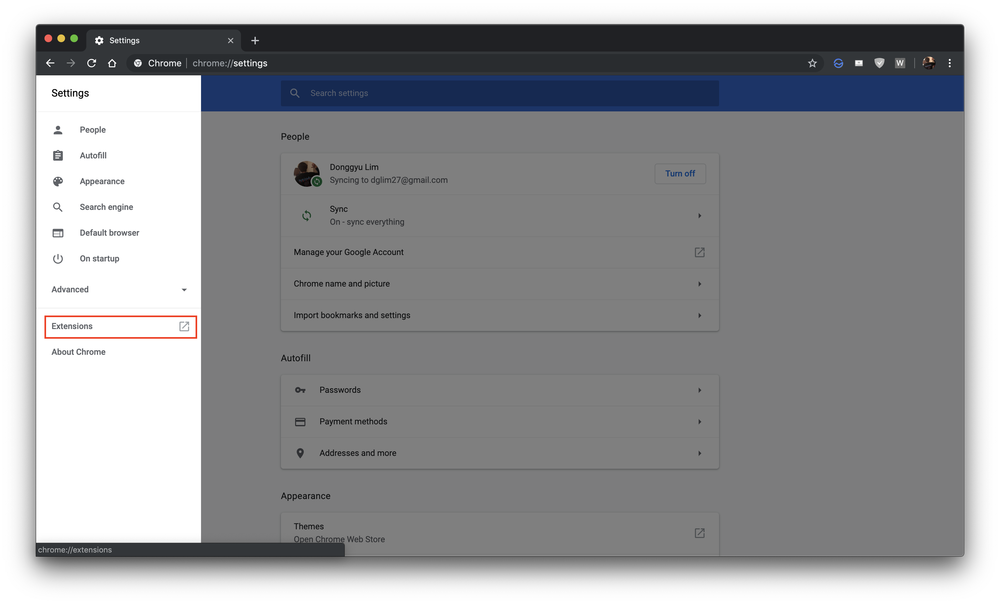
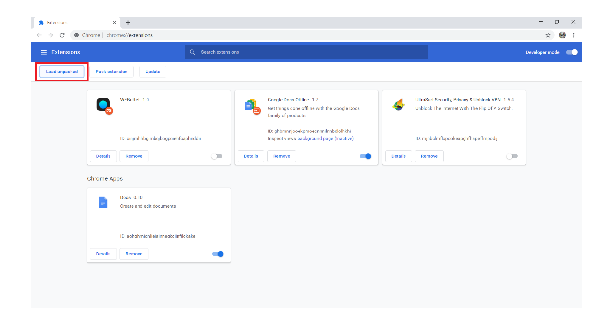
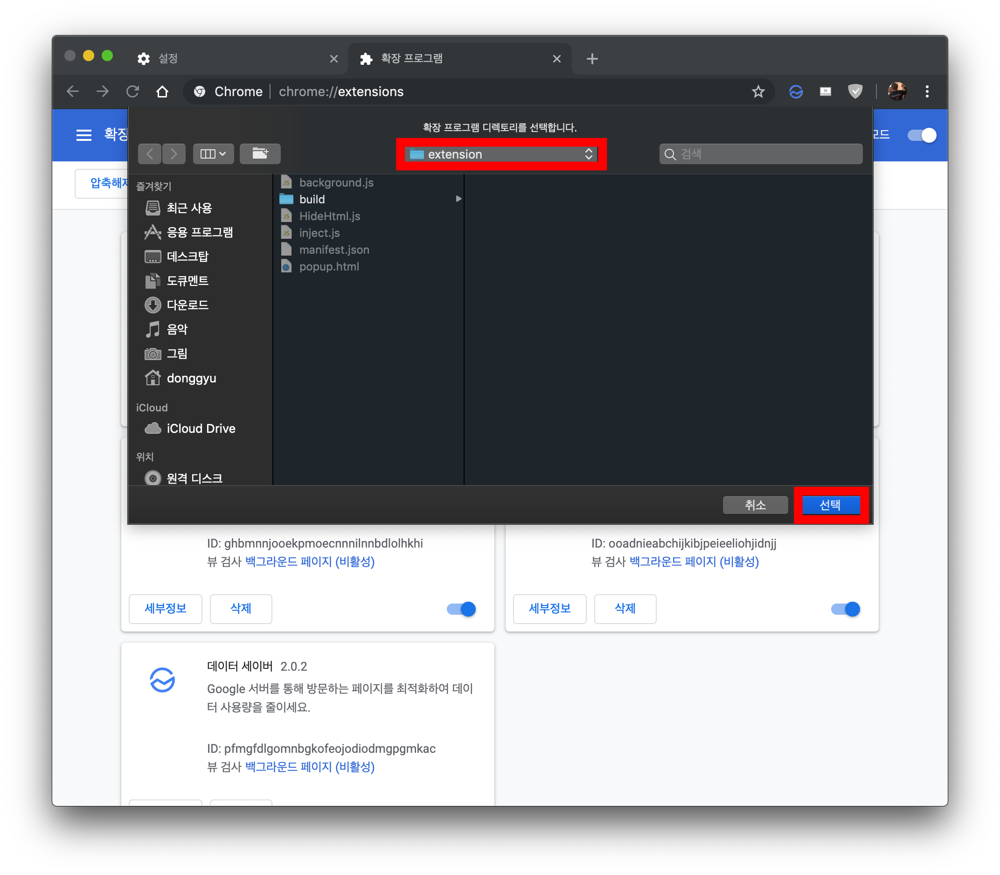
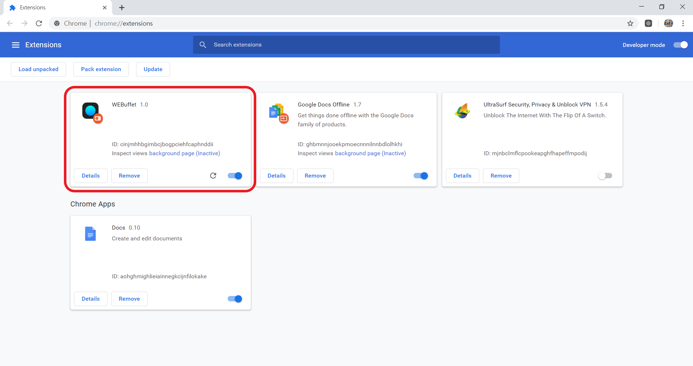
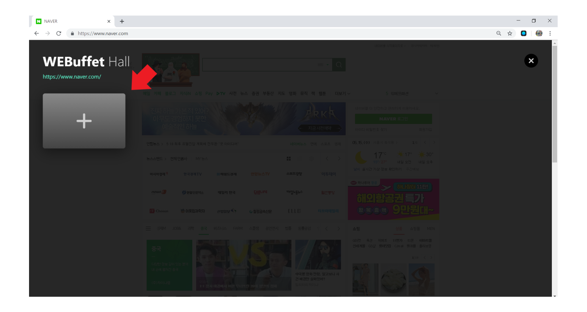
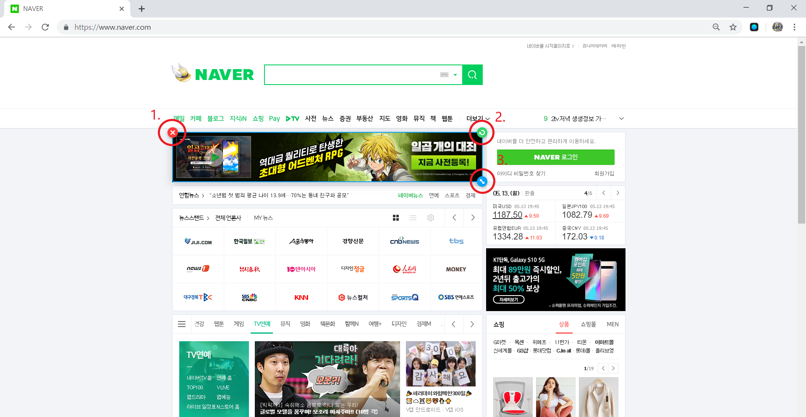
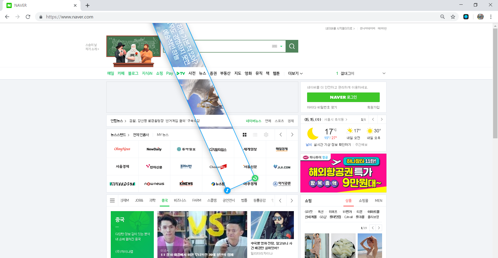
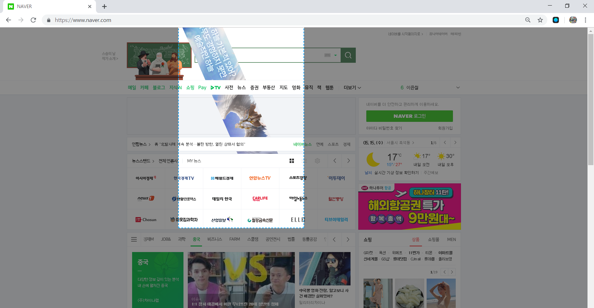

WEBuffet is a Chrome extension that allows you to manipulate websites as your tastes by deleting, moving or transforming any component within the page.


## Build instructions
You must install **Node.js** and **NPM** before following the instructions below.

Node.js download : https://nodejs.org/en/

1. Go to `src` directory
```bash
cd path/to/src/
```

2. Install packages
```bash
npm install
```

3. Build
```bash
npm run build
```


## Installation for builders (optional)

1. Open Chrome "Settings" -> "Extensions"


2. Activate "Developer mode" and Click "Load unpacked"


3. Choose `path/extension` folder and click select


4. Now activate WEBuffet and enjoy our program



## How to use WEBuffet

1. After activate WEBuffet, go to any site you want to change  
   (If it's working, the WEBuffet icon will appear)  


2. Click anywhere on website and click `+` button  



3. Stay your mouse pointer 1 second to select element  
   what you want to change  
   (If you go out of the border before being selected, it will be cancelled.)  


4. Choose what you want to do  
   (1 is delete, 2 is rotate, 3 is size, drag is move)  


5. If you want to 'undo' your choice, just press `ctrl + z`


6. If you want to 'redo' your choice, just press `ctrl + shift + z`


7. If you want to quit change selected one, just press `esc` button  
