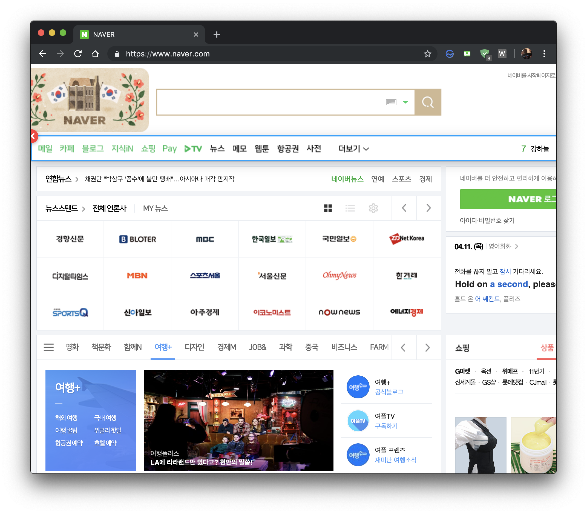
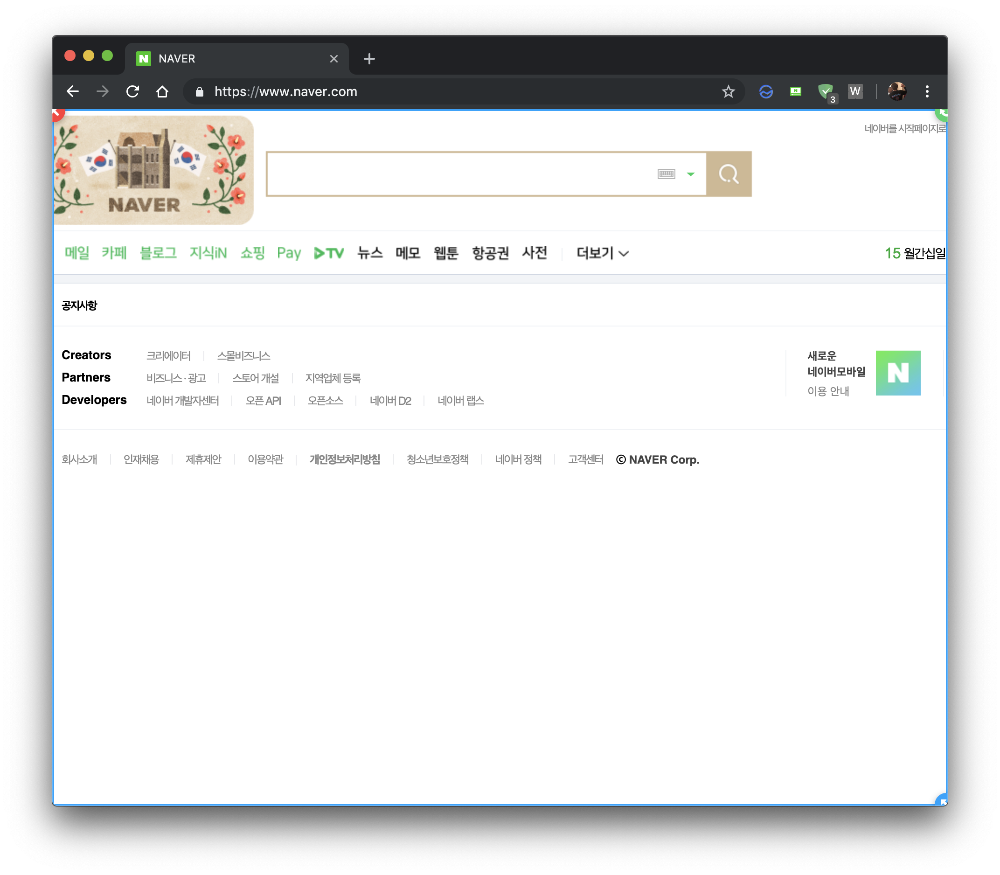

# WEBuffet

## Introduction
WEBuffet allows clients to manipulate any website as your tastes by deleting, moving or transforming any components within the page.

## Build instructions
You must install **Node.js** and **NPM** before following the instructions below.

1. Go to `src` directory
```bash
cd path/to/src/
```

2. Install packages
```bash
npm install
```

3. Build
```bash
npm run build
```


## Installation for builders (optional)

1. Open Chrome "Settings" -> "Extensions"


2. Activate "Developer mode" and Click "Load unpacked"


3. Choose `path/extension` folder and click select


4. Go any website and click anywhere for 1 second. Then you can activate webuffet.

